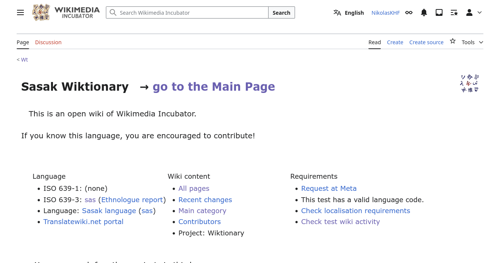
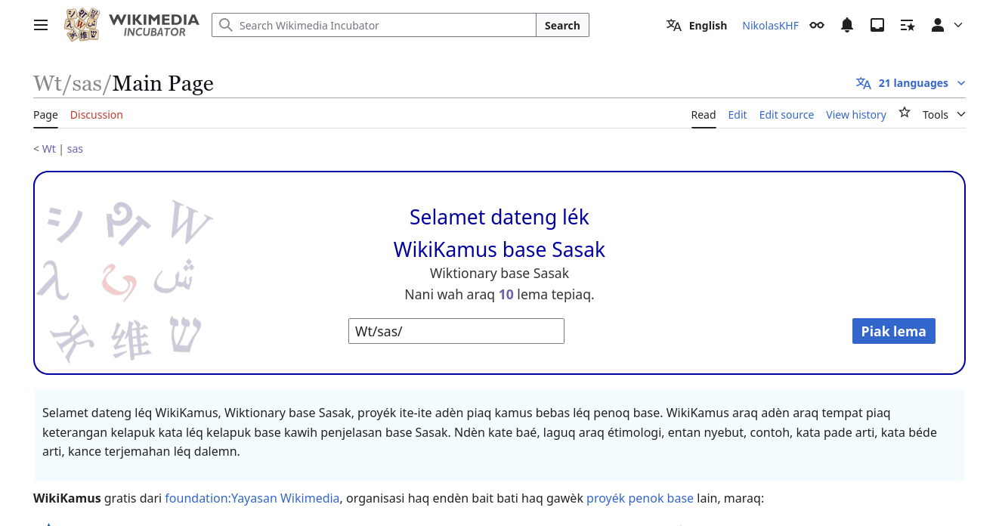
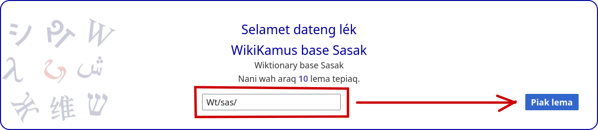
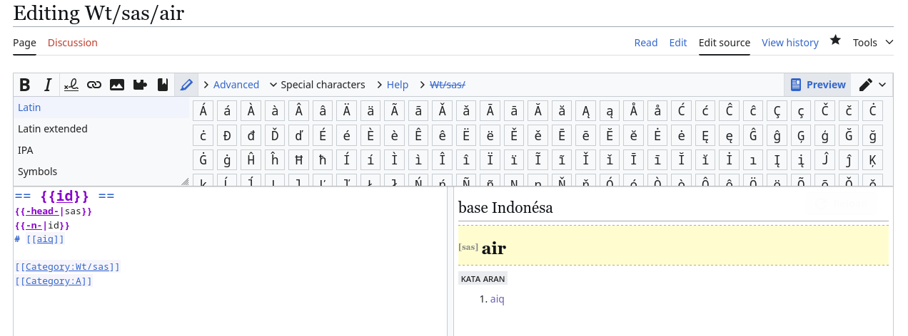
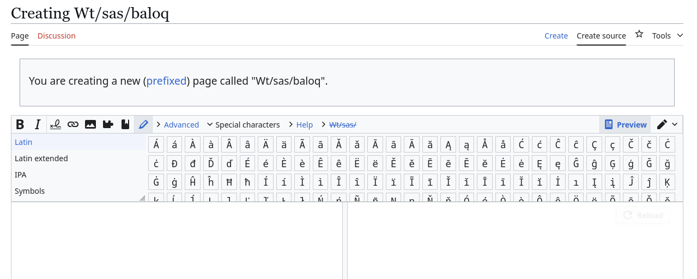
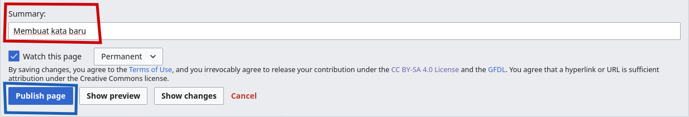
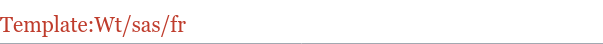
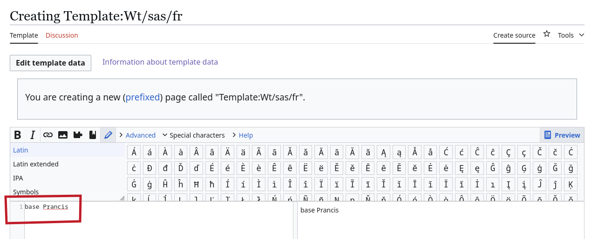

# Menyunting di WikiKamus base Sasak

Berkontribusi di Wikikamus base Sasak dapat dilakukan dengan mudah. Sebelumnya, Anda **disarankan** untuk memiliki akun Wikimedia sebelum menyunting agar setiap kontribusi Anda dapat dicatat. Untuk informasi pembuatan akun Wikimedia, silakan rujuk pada [halaman berikut](dasar/buat-akun.md).

Jika Anda sudah memiliki akun Wikimedia, Anda mungkin perlu masuk terlebih dahulu sebelum mulai berkontribusi pada WikiKamus base Sasak.

## Halaman awal

Jika Anda masuk ke halaman [WikiKamus base Sasak](https://incubator.wikimedia.org/wiki/Wt/sas) pada Wikimedia Incubator, Anda akan menemukan halaman seperti pada tangkapan layar di bawah.



Anda dapat masuk pada halaman utama proyek ini dengan menekan [**go to the Main Page**](https://incubator.wikimedia.org/wiki/Wt/sas/Main_Page). Maka, Anda akan menemukan tampilan seperti tangkapan layar di bawah.



Kita akan banyak bermain pada halaman ini. 

## Mencari kata atau membuat halaman baru

Untuk mencari kata atau membuat halaman baru, Anda dapat memasukkan kata pencarian pada kotak bertuliskan **Wt/sas/** lalu klik **Piak lema**.



Jika kata yang Anda masukkan sudah ada (misalnya *air*), Anda akan menuju halaman penyuntingan seperti gambar di bawah. 



Namun, jika kata yang Anda masukkan belum ada (misalnya dalam contoh ini *baloq*), Anda akan menuju halaman seperti gambar di bawah.



Dalam pencarian, pastikan Anda juga mencoba menggunakan aksen untuk huruf e (misalnya untuk e taling terbuka: è atau e taling tertutup: é). Lihat bagian [Huruf E](nyunting.md#huruf_e) di bawah.

## Memasukkan entri

Seperti yang sebelumnya disebutkan, Anda dapat memasukkan entri dengan memasukkan kata yang belum ada di WikiKamus base Sasak. Untuk melihat daftar kata yang sudah ada di WikiKamus base Sasak, silakan lihat [halaman berikut](https://incubator.wikimedia.org/wiki/Special:PrefixIndex/Wt/sas).

Untuk format dalam WikiKamus sendiri, kita akan menggunakan format yang direkomendasikan pada proyek ini, yaitu sebagai berikut. Untuk mempelajari lebih lanjut sintaks Wiki, silakan cek [halaman berikut](dasar/sintaks.md).

```MediaWiki
== {{KodeBahasa}} ==
{{-head-|KodeBahasa}}
{{-KelasKataPertama-|KodeBahasa}}

# Definisi satu
#: Contoh untuk definisi satu (opsional)
# Definisi dua (opsional)
#: Contoh untuk definisi dua (opsional)
# dst.
 
{{-KelasKataKedua-|KodeBahasa}}
# Definisi satu
#: Contoh untuk definisi satu (opsional)
# Definisi dua (opsional)
#: Contoh untuk definisi dua (opsional)
# dst.

dst
[[Category:HurufAwal]]
```

Dengan keterangan sebagai berikut:

* `KodeBahasa`: Kode bahasa menurut ISO untuk bahasa tersebut. Misalnya, kode bahasa Indonesia adalah `id`, untuk Sasak adalah `sas`, untuk Jawa adalah `jv`, untuk Inggris adalah `en`, dan lain sebagainya. Silakan lihat beberapa daftar kode bahasa yang sering digunakan dalam WikiKamus base Sasak, silakan lihat bagian [Kode bahasa](nyunting.md#kode_bahasa) di bawah.

* `KelasKataPertama` dan `KelasKataKedua` adalah kode kelas kata dari kata yang sedang disunting. Misalnya, untuk kata benda adalah `nom` atau `n`, kata kerja atau verba adalah `v` atau `verb`, kata sifat atau adjektiva adalah `a` atau `adj`, dan sebagainya. Lihat daftar kelas kata yang sudah dimasukkan ke dala WikiKamus base Sasak pada bagian [Kelas Kata](nyunting.md#kelas_kata) di bawah.

* `HurufAwal` adalah huruf pertama pada kata yang mau disunting (pastikan huruf kapital).

Sebagai contoh, kita akan membuat kata *baloq* atau buaya pada WikiKamus base Sasak.

1. Pastikan kata yang dimasukkan ***dimulai dengan huruf kecil***, kecuali untuk kata yang HARUS diawali huruf besar seperti nama atau beberapa kata benda di bahasa-bahasa seperti Jerman, dan sebagainya. Maka, kita akan memasukkan kata ***baloq*** (dengan huruf "b" kecil) pada kotak pencarian.

2. Kata ***baloq*** adalah kata dalam ***bahasa sasak***. Maka kode bahasa yang kita gunakan adalah `sas` untuk Sasak.

3. Kata ***baloq*** adalah ***kata benda***, maka kelas kata yang kita masukkan adalah `n` untuk noun.

4. Sekarang kita bisa memasukkan arti kata tersebut. Misalnya, di sini saya memasukkan arti kata ***baloq*** sebagai *"réptil pélo haq mangan daging, biase warne ijo ato abu"* (reptil panjang yang makan daging, biasanya berwarna hijau atau abu-abu).

5. Untuk contoh, definisi kedua, dan kelas kata kedua saya tidak masukkan karena opsional. Jika ada, Anda dapat tambahkan.

6. Kata ***baloq*** dimulai dengan huruf B. Maka untuk kategori, saya masukkan `[[Category:B]]`.

Dari penjelasan di atas, maka saya masukkan teks berikut pada kotak teks di bagian kiri pada halaman ***baloq***:

```MediaWiki
== {{sas}} ==
{{-head-|sas}}
{{-n-|sas}}

# [[réptil]] [[pélo]] haq [[mangan]] daging, biase warne ijo ato abu

[[Category:B]]
```


> Perhatikan bahwa saya menambahkan dua kurung kotak di antara kata "réptil", "pélo", dan "mangan". Hal ini agar ketiga kata tersebut dapat diklik dan pengguna dapat mengetahui arti dari masing-masing kata tersebut. Anda dapat menambahkan dua kurung kotak tersebut pada kata yang menurut Anda dapat membantu pembaca lebih memahami arti kata yang sedang mereka baca. Untuk mempelajari lebih lanjut tentang sintaks Wiki, silakan lihat [halaman berikut](dasar/sintaks.md).

Jika sudah, Anda dapat menggulir sedikit ke bawah hingga menemukan bagian seperti gambar di bawah. Anda dapat memasukkan rangkuman apa yang telah Anda lakukan pada bagian yang dikotakkan merah (Summary) dan dapat mempublikasikan suntingan Anda pada tombol ***Publish page*** yang dikotakkan biru.



Selamat! Anda sudah membuat suntingan Anda di WikiKamus base Sasak! Terima kasih!

## Huruf E

Dalam bahasa Sasak, huruf "E" dapat dibaca sesuai dengan "e pepet" atau "e taling". Anda disarankan untuk menggunakan penulisan E yang sesuai dengan cara baca kata tersebut.

* E pepet (ditulis dengan ***"e"***): E untuk kata-kata seperti *besar*, *tepat*, *base*, *selamet*, dan semacamnya.

* E taling dibagi menjadi dua, yaitu:

    * E taling tertutup (e taling, dengan bukaan mulut sedang; ditulis dengan ***"è"***): *sèri* (dalam "film seri"), *militèr*, *adèn*, dan semacamnya.

    * E taling terbuka (e taling, dengan bukaan mulut lebar; ditulis dengan ***"é"***): *téras* (halaman depan rumah), *kécap* (saus hitam manis atau asin), *lémaq* (besok), dan sebagainya.
    
Silakan gunakan diakritik yang menurut Anda benar saat menulis.

## Kode bahasa

Daftar kode bahasa menurut ISO dapat dilihat pada [halaman berikut](https://iso639-3.sil.org/code_tables/639/data). Jika bahasa tersebut memiliki kode `639-3` dan `639-1`, gunakan kode `639-1`, misalnya Indonesia memiliki kode `639-1` sebagai `id` dan `639-3` sebagai `ind`, maka kode bahasa yang digunakan adalah `id`. 

Berikut beberapa kode bahasa yang akan sering digunakan di WikiKamus base Sasak:

* `sas` untuk bahasa Sasak

* `id` untuk bahasa Indonesia

* `smw` untuk bahasa Sumbawa

* `ban` untuk bahasa Bali

* `jv` untuk bahasa Jawa

* `en` untuk bahasa Inggris

Jika Anda menggunakan kode bahasa, lalu terdapat tampilan seperti di bawah (dalam contoh, menggunakan kode bahasa Prancis, `fr`), Anda dapat membuat halaman untuk kode bahasa tersebut.



Caranya adalah dengan klik tautan merah tersebut, lalu masukkan nama bahasanya. Misalnya, untuk `fr` adalah bahasa Prancis. Maka saya masukkan "base Prancis". Setelah itu, silakan publikasikan.



## Kelas kata

Kelas atau jenis kata yang sudah ada di WikiKamus base Sasak:

* **Kata benda**, **nomina**, atau ***noun***: gunakan kode `nom` atau `n`

* **Kata kerja**, **verba**, atau ***verb***: gunakan kode `verb` atau `v`

* **Kata sifat**, **adjektiva**, atau ***adjective*** (penjelas kata benda): gunakan kode `adj` atau `a`

* **Kata keterangan**, **adverbia**, atau ***adverb*** (penjelas kata kerja): gunakan kode `adv`

* **Bilangan**, **angka**, atau **numeria** (kata yang berhubungan dengan angka): gunakan kode `num`

* **Konjungsi** (dan, atau, dsb.): gunakan kode `kon`

* **Pronomina** (kata ganti: saya, kamu, ini, itu, dsb.): gunakan kode `pron` atau `pronom`

* **Preposisi** (kata depan: dari, di, ke, dsb.): gunakan kode `prep`

* **Partikel** (kata sejenis *eh*, *ah*, *oh*, dan semacamnya): gunakan kode `part`

***

> **INGAT!**
> 
> Templat dari kelas kata diawali dan diakhiri oleh garis pemisah. Misalnya, templat **kata benda** memiliki nama `{{-nom-}}` atau `{{-n-}}` dan bukan `{{nom}}` atau `{{n}}`. 

